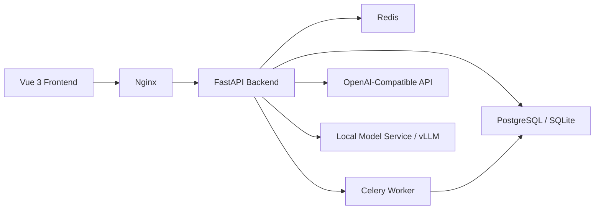

# Boring Financial

Boring Financial 是一个面向软件工程课程大作业的智能账单分类系统。项目把早期 rule-based Python 脚本升级为前后端分离、多用户、可部署、可切换分类模型的软件系统，支持微信/支付宝账单导入、自动分类、人工校正、统计看板和 PDF 报表。

## 项目目标

- 提供完整的账单管理 demo 闭环：导入 -> 解析 -> 分类 -> 校正 -> 分析 -> 报表。
- 在低配服务器上保持可运行，优先复用已有聚合接口和前端派生展示。
- 保留规则分类兜底，同时支持 OpenAI-compatible API 和本地模型服务。
- 为课程答辩提供清晰的架构、接口、开发、部署和测试材料。

## 核心功能

- 多用户注册、登录与账单隔离。
- 微信/支付宝账单文件导入、批次进度展示和批次删除。
- 规则分类、模型分类、分类缓存组成的混合分类链路。
- 交易列表筛选：分页、平台、日期、分类、导入文件、待校正状态和关键词搜索。
- 分类校正工作台：查看模型建议、置信度、分类理由并人工确认。
- 分类管理：系统分类和用户自定义分类共存。
- Dashboard 财务驾驶舱：收入、支出、结余、储蓄率、Top 商户、分类占比、导入任务状态。
- 报表中心：按日期和导入文件生成 PDF 报表并下载。
- 系统设置演示页：展示 provider、低置信度阈值和模型配置。

## 系统架构



## 技术栈

- Backend: FastAPI, SQLAlchemy 2.x, Alembic, Pydantic, Celery, Redis, PostgreSQL/SQLite, fpdf2
- Frontend: Vue 3, TypeScript, Vite, Pinia, Vue Router, Element Plus, ECharts
- AI: Rule-based classifier, OpenAI-compatible provider, local model provider
- Deployment: Docker Compose, Nginx, bare-metal systemd/Nginx

## 快速启动

后端使用 `uv` 管理依赖，启动前先确认：

```bash
uv --version
```

### 方式 A：轻量本地启动（推荐用于课程 demo）

这个方式使用 SQLite，不要求先安装 PostgreSQL 或 Redis。后端启动时会自动创建表和默认分类。

PowerShell:

```powershell
cd backend
Copy-Item .env.bare.example .env
uv sync --extra dev
uv run uvicorn backend.main:app --reload
```

Bash:

```bash
cd backend
cp .env.bare.example .env
uv sync --extra dev
uv run uvicorn backend.main:app --reload
```

后端默认地址：

```text
http://127.0.0.1:8000
```

### 方式 B：PostgreSQL + Redis 本地启动

如果希望更接近 Docker/生产环境，先启动依赖服务：

```bash
cd infra
docker compose up -d postgres redis
```

再启动后端：

PowerShell:

```powershell
cd ..\backend
Copy-Item .env.example .env
uv sync --extra dev
uv run uvicorn backend.main:app --reload
```

Bash:

```bash
cd ../backend
cp .env.example .env
uv sync --extra dev
uv run uvicorn backend.main:app --reload
```

说明：当前应用启动时会执行 `Base.metadata.create_all()` 并补齐默认分类，所以本地快速启动不依赖 Alembic migration。Alembic 配置保留给后续正式迁移版本管理使用。

### 前端

```bash
cd frontend
npm install
npm.cmd run dev
```

非 Windows 环境可使用：

```bash
npm run dev
```

默认访问地址：

```text
http://127.0.0.1:5173
```

### Docker Compose

```bash
cd infra
docker compose up --build
```

默认由 Nginx 暴露入口：

```text
http://127.0.0.1/
```

## 主要页面

- 登录/注册：深色品牌区 + 白色登录卡片。
- Dashboard：财务驾驶舱、筛选区、趋势图、分类图和导入任务。
- 导入账单：拖拽上传、最近导入结果、文件记录和批次表。
- 交易列表：紧凑筛选、交易表格、详情抽屉和校正入口。
- 分类校正工作台：左侧待校正队列，右侧交易详情和人工确认。
- 分类管理：分类指标、新增分类、分类列表。
- 报表中心：条件选择、摘要预览、PDF 生成和预览下载。
- 系统设置：课程 demo 用的 provider 和阈值配置展示。

## 目录结构

```text
backend/   FastAPI 后端、模型、服务、任务和测试
frontend/  Vue 3 前端应用
infra/     Docker Compose、Nginx、systemd、mock model service
docs/      架构、接口、开发、部署、测试文档
legacy/    旧版脚本和说明
scripts/   本地开发与部署辅助脚本
```

## 文档索引

- [架构文档](./docs/architecture.md)
- [接口文档](./docs/api.md)
- [开发文档](./docs/development.md)
- [Docker 部署文档](./docs/deployment.md)
- [裸机部署文档](./docs/deployment-baremetal.md)
- [测试文档](./docs/testing.md)
- [旧版工具说明](./legacy/README-legacy.md)

## 当前状态

当前仓库已经具备课程 demo 所需的主要产品闭环。前端已重设计为深色侧边栏、白色工作台和绿色金融主色的后台系统；后端接口保持稳定，适合低配服务器部署和课堂演示。生产化继续增强时，优先补充接口测试、前端端到端测试、报表历史列表和更细的分类规则管理。
