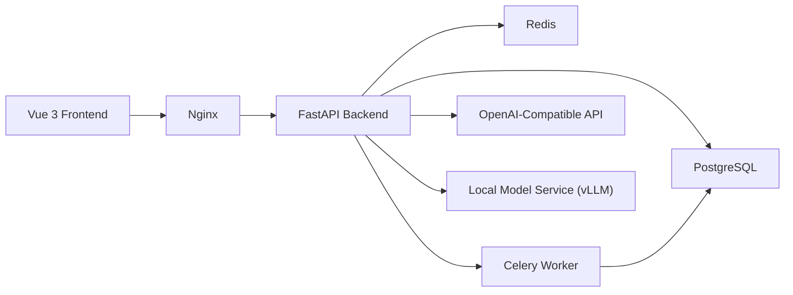

# Boring Financial

一个面向课程大作业的智能账单分类系统。项目将原始的 rule-based Python 脚本升级为前后端分离、多用户、可部署、可切换分类模型的软件系统，支持微信/支付宝账单导入、自动分类、人工校正、统计看板和 PDF 报表。

## 项目目标

- 将旧版脚本重构为符合软件工程规范的 monorepo
- 使用大模型 API 替代纯规则分类，并保留规则兜底
- 支持后续切换到自部署开源模型服务
- 为课程答辩提供完整的架构、接口、测试和部署材料

## 核心功能

- 多用户注册、登录与账单隔离
- 微信/支付宝账单文件导入与统一解析
- 规则分类 + 大模型分类 + 分类缓存的混合分类链路
- 分类校正工作台与用户自定义分类
- Dashboard 统计、Top 商户、大额支出、导入任务状态
- PDF 报表导出
- OpenAI-compatible provider 切换到本地模型服务

## 系统架构



## 技术栈

- Backend: FastAPI, SQLAlchemy 2.x, Alembic, Celery, Redis, PostgreSQL
- Frontend: Vue 3, TypeScript, Vite, Pinia, Vue Router, Element Plus, ECharts
- AI: Rule-based classifier, OpenAI-compatible API, local model provider
- Deployment: Docker Compose, Nginx, vLLM

## 快速启动

### 1. 启动依赖服务

```bash
cd infra
docker compose up -d postgres redis
```

### 2. 启动后端

```bash
cd backend
pip install -e .[dev]
copy .env.example .env
alembic upgrade head
uvicorn backend.main:app --reload
```

### 3. 启动前端

```bash
cd frontend
npm install
npm run dev
```

### 4. 启动完整容器化环境

```bash
cd infra
docker compose up --build
```

## 主要页面

- 登录/注册
- Dashboard
- 账单导入
- 交易列表
- 分类校正工作台
- 分类管理
- 报表中心
- 系统设置

## 目录结构

```text
backend/   FastAPI, SQLAlchemy, Celery, Alembic
frontend/  Vue 3, TypeScript, Vite
infra/     Docker Compose, Nginx, model service
docs/      架构、接口、开发、部署、测试文档
legacy/    旧版单体脚本与旧使用方式
scripts/   辅助脚本与种子数据入口
```

## 开发流程概览

1. 导入账单文件
2. 解析为统一交易结构
3. 规则分类优先命中
4. 未命中或低置信度时调用模型
5. 结果落库并进入校正工作台
6. Dashboard 聚合与 PDF 报表生成

## 部署概览

- `frontend`、`backend`、`worker`、`postgres`、`redis`、`nginx`、`model-service`
- 单机 Docker Compose 部署
- `model-service` 默认使用 OpenAI-compatible 接口，后端仅通过配置切换 provider

## 文档索引

- [架构文档](./docs/architecture.md)
- [接口文档](./docs/api.md)
- [开发文档](./docs/development.md)
- [部署文档](./docs/deployment.md)
- [测试文档](./docs/testing.md)
- [旧版工具说明](./legacy/README-legacy.md)

## 当前状态

本仓库已完成 monorepo 重构骨架，并提供可继续扩展的后端、前端、部署与文档基础。若需继续推进到生产级可用，需要在具备 Python 运行环境和数据库依赖的情况下补做本地联调与自动化测试。
