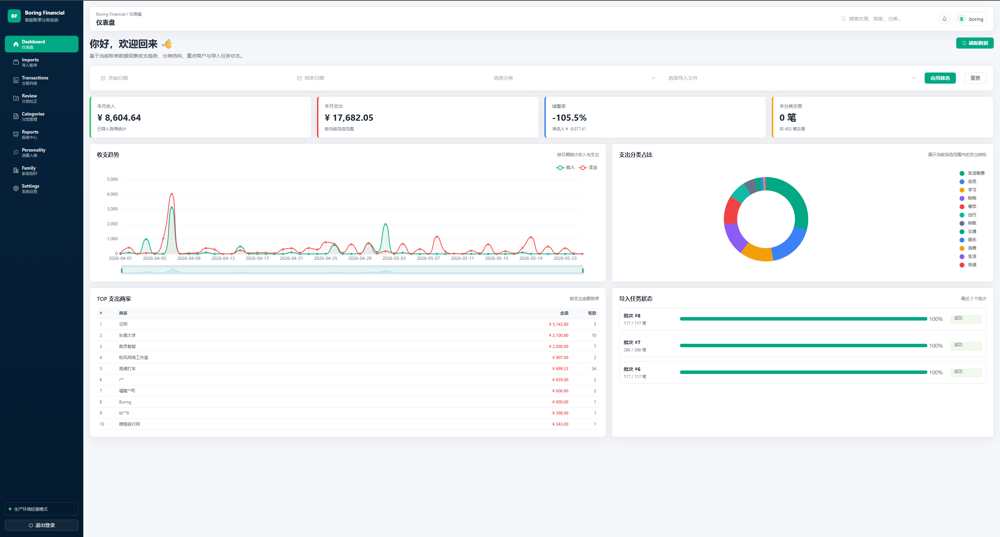
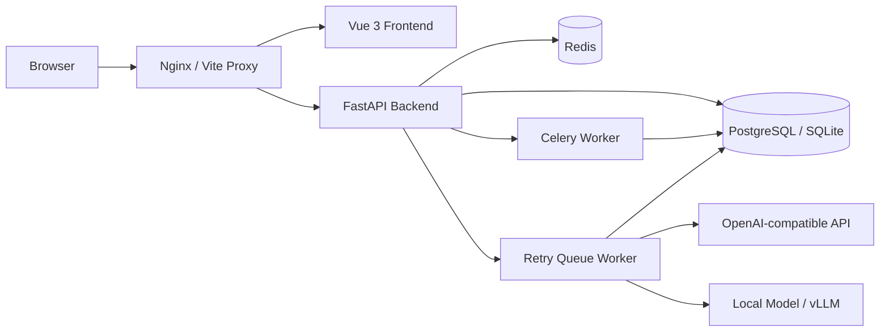

# Boring Financial

<p align="center">
  面向个人与家庭场景的智能账单分类和消费分析平台
</p>

<p align="center">
  <a href="https://www.python.org/"></a>
  <a href="https://fastapi.tiangolo.com/"></a>
  <a href="https://vuejs.org/"></a>
  <a href="https://www.typescriptlang.org/"></a>
  <a href="https://www.docker.com/"></a>
</p>

Boring Financial 将微信、支付宝等平台导出的账单转换为统一交易数据，通过“规则匹配 + 大模型语义分类 + 人工校正”完成账单整理，并提供财务看板、消费人格、家庭聚合和 PDF 报表。



## 目录

- [核心能力](#核心能力)
- [系统架构](#系统架构)
- [技术栈](#技术栈)
- [快速开始](#快速开始)
- [本地开发](#本地开发)
- [配置说明](#配置说明)
- [测试](#测试)
- [项目结构](#项目结构)
- [运维命令](#运维命令)
- [项目文档](#项目文档)
- [参与贡献](#参与贡献)
- [许可证](#许可证)

## 核心能力

| 模块 | 能力 |
| --- | --- |
| 账单导入 | 导入微信、支付宝账单，展示批次进度，支持去重和批次删除 |
| 智能分类 | 组合规则、分类缓存、OpenAI-compatible API 和本地模型完成语义分类 |
| 人工校正 | 查看模型建议、置信度和分类理由，确认或修改低置信度交易 |
| 交易管理 | 按日期、平台、分类、导入文件、校正状态和关键词筛选 |
| 财务分析 | 展示收入、支出、结余、储蓄率、收支趋势、分类占比和 Top 商户 |
| 消费人格 | 基于交易数据生成消费人格画像、财务健康评分和问卷偏差分析 |
| 家庭组织 | 管理 owner、admin、member 角色，聚合家庭成员的财务数据 |
| 报表中心 | 按日期和导入文件生成、预览和下载 PDF 财务报表 |
| 可靠性机制 | 将外部模型失败任务写入重试队列，由后台 worker 串行重试 |
| 多用户隔离 | 使用 JWT 鉴权，并按用户隔离账单、分类、报表和组织资源 |

## 系统架构


```mermaid
flowchart LR
    Browser["Browser"] --> Gateway["Nginx / Vite Proxy"]
    Gateway --> Frontend["Vue 3 Frontend"]
    Gateway --> Backend["FastAPI Backend"]
    Backend --> Database[("PostgreSQL / SQLite")]
    Backend --> Redis[("Redis")]
    Backend --> Celery["Celery Worker"]
    Backend --> Retry["Retry Queue Worker"]
    Celery --> Database
    Retry --> Database
    Retry --> API["OpenAI-compatible API"]
    Retry --> Local["Local Model / vLLM"]
```

前后端位于同一 monorepo。开发环境可使用 SQLite 和同步任务模式快速启动；完整部署可使用 PostgreSQL、Redis、Celery、Nginx 和独立模型服务。

## 技术栈

| 层级 | 技术 |
| --- | --- |
| 前端 | Vue 3、TypeScript、Vite、Pinia、Vue Router、Element Plus、ECharts |
| 后端 | FastAPI、SQLAlchemy 2.x、Pydantic、Alembic、Celery |
| 数据 | PostgreSQL、SQLite、Redis |
| AI | 规则分类、OpenAI-compatible API、本地模型、vLLM |
| 报表 | fpdf2 |
| 工程化 | uv、npm、pytest、Vitest、Docker Compose、Nginx |

## 快速开始

### Docker Compose

这是体验完整系统最直接的方式。默认 Compose 配置包含 PostgreSQL、Redis、前后端、Celery worker、Nginx 和 mock 模型服务。

```bash
git clone https://github.com/BoringZheng/Boring-Financial.git
cd Boring-Financial

cp infra/.env.example infra/.env
docker compose --env-file infra/.env -f infra/docker-compose.yml up --build
```

服务启动后访问：

- Web 应用：<http://127.0.0.1/>
- 健康检查：<http://127.0.0.1/health>
- 后端接口文档：<http://127.0.0.1:8000/docs>

停止服务：

```bash
docker compose --env-file infra/.env -f infra/docker-compose.yml down
```

> [!IMPORTANT]
> 示例环境变量和 Compose 文件面向本地开发与演示。部署到公网前，请修改数据库密码，按部署文档向后端传递安全的 `SECRET_KEY`，限制服务端口，并配置 HTTPS。完整说明见[部署文档](./docs/deployment.md)。

## 本地开发

### 环境要求

- Python 3.11+
- [uv](https://docs.astral.sh/uv/)
- Node.js 20+
- npm

### 1. 启动后端

轻量开发模式使用 SQLite，不要求 PostgreSQL 或 Redis：

```bash
cd backend
cp .env.bare.example .env
uv sync --extra dev
uv run uvicorn backend.main:app --reload
```

后端默认运行于 <http://127.0.0.1:8000>。首次启动会自动创建运行期数据表并初始化默认分类。

### 2. 启动前端

打开另一个终端：

```bash
cd frontend
npm ci
npm run dev
```

前端默认运行于 <http://127.0.0.1:5173>，Vite 会将 `/api` 请求代理到本地后端。

Windows PowerShell 可将 `cp` 替换为 `Copy-Item`，并在脚本执行受限时使用 `npm.cmd run dev`。

### PostgreSQL + Redis 开发模式

```bash
docker compose -f infra/docker-compose.yml up -d postgres redis

cd backend
cp .env.example .env
uv sync --extra dev
uv run uvicorn backend.main:app --reload
```

如需异步执行导入任务，再启动 Celery worker：

```bash
cd backend
uv run celery -A backend.core.celery_app.celery_app worker -l info
```

## 配置说明

后端从 `backend/.env` 读取配置，完整示例见：

- [`backend/.env.bare.example`](./backend/.env.bare.example)：SQLite 轻量模式
- [`backend/.env.example`](./backend/.env.example)：PostgreSQL + Redis 模式
- [`infra/.env.example`](./infra/.env.example)：Docker Compose 模式

常用配置：

| 变量 | 说明 | 默认值或示例 |
| --- | --- | --- |
| `SECRET_KEY` | JWT 签名密钥，生产环境必须修改 | `change-me` |
| `DATABASE_URL` | SQLAlchemy 数据库连接 | `sqlite:///./storage/app.db` |
| `REDIS_URL` | Celery 使用的 Redis 地址 | `redis://localhost:6379/0` |
| `CLASSIFICATION_PROVIDER` | 默认分类链路，可设为 `composite` 或 `local_model` | `composite` |
| `OPENAI_API_BASE` | OpenAI-compatible API 地址 | `https://api.openai.com/v1` |
| `OPENAI_API_KEY` | 外部模型 API Key | 空 |
| `OPENAI_MODEL` | 外部模型名称 | `gpt-4.1-mini` |
| `LOCAL_MODEL_API_BASE` | 本地模型兼容接口地址 | `http://127.0.0.1:8001/v1` |
| `LOCAL_MODEL_NAME` | 本地模型名称 | `Qwen2.5-7B-Instruct` |
| `LOW_CONFIDENCE_THRESHOLD` | 进入人工校正的置信度阈值 | `0.75` |
| `TASK_ALWAYS_EAGER` | 是否同步执行 Celery 任务 | `true` |
| `CORS_ORIGINS` | 允许跨域访问的来源，逗号分隔 | `http://localhost:5173` |
| `VITE_API_BASE_URL` | 前端 API 基础路径 | `/api` |

未配置真实模型 API 时，系统仍可使用规则分类；Docker Compose 默认提供 mock OpenAI-compatible 模型服务用于联调。

## 测试

运行后端测试：

```bash
cd backend
uv sync --extra dev
uv run pytest
```

生成后端覆盖率：

```bash
cd backend
uv run pytest --cov=backend
```

运行前端单元测试和生产构建：

```bash
cd frontend
npm ci
npm test
npm run build
```

更完整的验收流程见[测试文档](./docs/testing.md)。

## 项目结构

```text
Boring-Financial/
├── backend/                 FastAPI 应用、业务服务、任务和测试
│   ├── src/backend/api/     API 路由与鉴权依赖
│   ├── src/backend/models/  SQLAlchemy 数据模型
│   ├── src/backend/services/ 核心业务逻辑
│   └── tests/               pytest 测试
├── frontend/                Vue 3 前端
│   └── src/
│       ├── api/             API 客户端
│       ├── pages/           页面组件
│       ├── stores/          Pinia 状态管理
│       └── __tests__/       Vitest 测试
├── infra/                   Compose、Nginx、systemd 和模型服务
├── docs/                    架构、接口、开发、部署和课程报告
├── scripts/                 开发与部署脚本
├── legacy/                  旧版账单处理脚本
└── category_map.csv         默认分类规则数据
```

## 运维命令

管理命令需要在 `backend/` 目录下执行：

```bash
# 将已有用户设为管理员
uv run bf-admin make-admin <username>

# 重新入队所有外部模型调用失败的交易
uv run bf-admin retry-all

# 仅处理指定用户
uv run bf-admin retry-all --user-id <id>
```

`retry_queue` 表示交易正在等待后台重试；`retry_failed` 表示已达到最大重试次数，需要管理员重新入队或人工处理。

## 项目文档

- [开发指南](./docs/development.md)
- [系统架构](./docs/architecture.md)
- [API 文档](./docs/api.md)
- [测试指南](./docs/testing.md)
- [Docker 部署](./docs/deployment.md)
- [裸机部署](./docs/deployment-baremetal.md)
- [旧版脚本说明](./legacy/README-legacy.md)

FastAPI 启动后也可通过 `/docs` 查看自动生成的 OpenAPI 文档。

## 参与贡献

欢迎通过 Issue 报告问题或提出功能建议。提交 Pull Request 前，请：

1. Fork 仓库并从最新分支创建功能分支。
2. 保持改动聚焦，并同步更新相关测试和文档。
3. 运行后端测试、前端测试和前端生产构建。
4. 在 Pull Request 中说明背景、主要改动和验证方式。

提交信息建议遵循 [Conventional Commits](https://www.conventionalcommits.org/)：

```text
feat: add transaction export
fix: handle duplicate import files
docs: update deployment guide
```

## 许可证

当前仓库尚未包含 `LICENSE` 文件。在明确许可证之前，项目代码默认保留所有权利；如需复制、修改或分发，请先联系仓库维护者。
