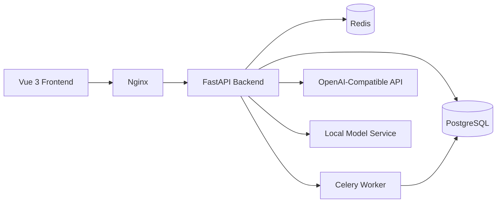

# 架构文档

## 1. 总体架构

Boring Financial 采用前后端分离 monorepo 架构，核心目标是把旧版脚本重构为一个多用户、可部署、可替换分类模型的软件系统。

## 2. 模块边界

### 前端

- `frontend/src/pages/LoginPage.vue`: 登录与注册
- `frontend/src/pages/DashboardPage.vue`: 统计总览
- `frontend/src/pages/ImportsPage.vue`: 账单上传
- `frontend/src/pages/TransactionsPage.vue`: 交易列表
- `frontend/src/pages/ReviewPage.vue`: 分类校正
- `frontend/src/pages/CategoriesPage.vue`: 分类管理
- `frontend/src/pages/ReportsPage.vue`: 报表生成与下载
- `frontend/src/pages/SettingsPage.vue`: provider 与阈值展示

### 后端

- `auth`: 注册、登录、当前用户信息
- `categories`: 系统分类与用户自定义分类
- `imports`: 文件上传、导入批次、账单解析
- `transactions`: 交易查询与人工分类修正
- `classification`: 重分类接口与 provider 切换
- `analytics`: Dashboard 聚合
- `reports`: PDF 报表生成与下载
- `jobs`: Celery 异步任务入口

## 3. 数据流

1. 用户上传微信或支付宝账单文件。
2. 后端保存原始文件并创建 `import_batches`、`uploaded_files`。
3. `ParserRegistry` 解析文件，归一化为统一交易结构。
4. `TransactionNormalizer` 生成规范化字段与去重哈希。
5. `CompositeClassifier` 先走规则匹配，再走缓存，最后调用模型 provider。
6. 自动分类结果写入 `transactions` 和 `classification_results`。
7. 低置信度或无类目结果进入校正工作台。
8. Dashboard 与 PDF 报表从交易表聚合生成。

## 4. 分类器抽象

分类器统一输出以下字段：

- `category_id`
- `subcategory_name`
- `confidence`
- `reason`
- `provider`
- `raw_response`

当前实现的 provider：

- `rule`: 规则分类
- `openai_compatible_api`: 外部大模型 API
- `composite`: 规则优先 + 缓存 + API
- `local_model`: 本地 OpenAI-compatible 模型服务

## 5. 异步任务设计

虽然当前导入与报表逻辑在开发态可以同步执行，但代码层已经为 Celery 预留任务入口：

- `import.process_batch`
- `classification.reclassify`
- `reports.build`

开发环境可通过 `TASK_ALWAYS_EAGER=true` 直接执行；生产环境通过 worker 消费 Redis 队列。

## 6. 多用户隔离策略

- 所有业务表以 `user_id` 关联用户
- 访问接口统一从 Bearer Token 解析当前用户
- 查询、更新、下载前都验证资源归属
- 系统分类 `user_id = null`，用户分类 `user_id = 当前用户`

## 7. 本地模型替换方案

### 开发态

- `infra/model-service/app.py` 提供 mock OpenAI-compatible 服务
- 用于联调 provider 切换与前后端演示

### 云端

- `infra/docker-compose.cloud.yml` 使用 `vllm/vllm-openai`
- 将 `LOCAL_MODEL_API_BASE` 指向 vLLM 服务
- 后端无需改业务代码，只切配置

## 8. 后续增强建议

- 引入真正的 Alembic 迁移版本管理
- 对导入和报表生成完全改为异步任务
- 增加更完整的批量校正和图表展示
- 加入评测集管理与 LoRA 微调脚本
