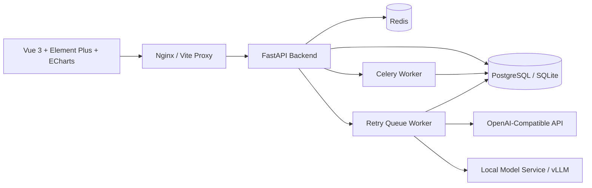
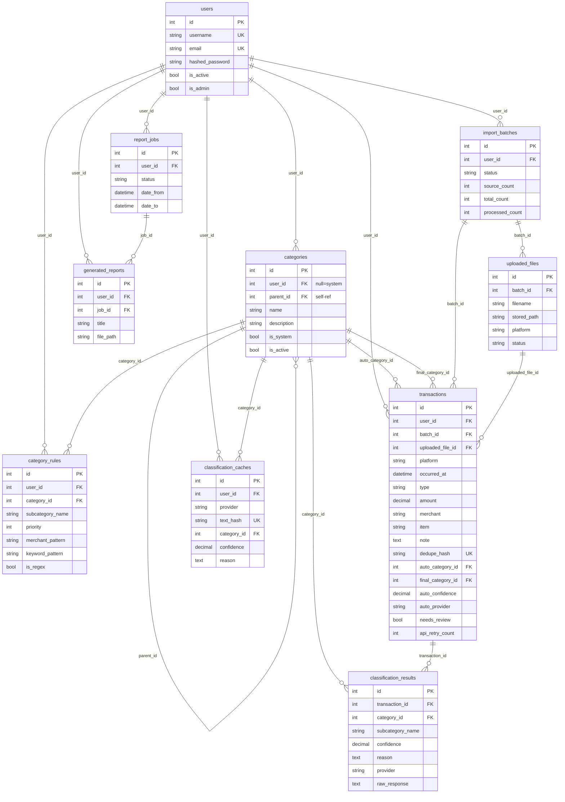
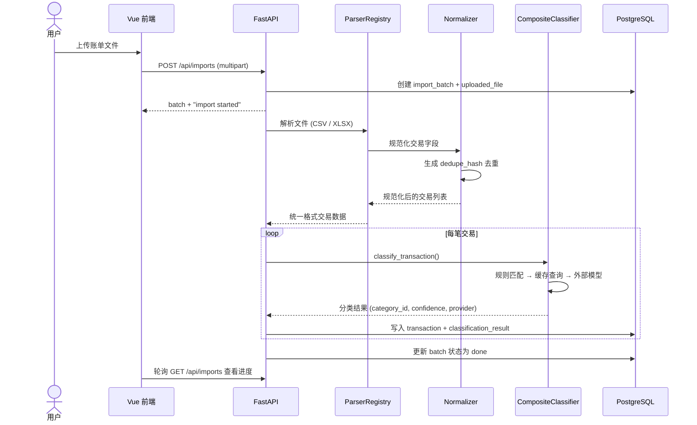
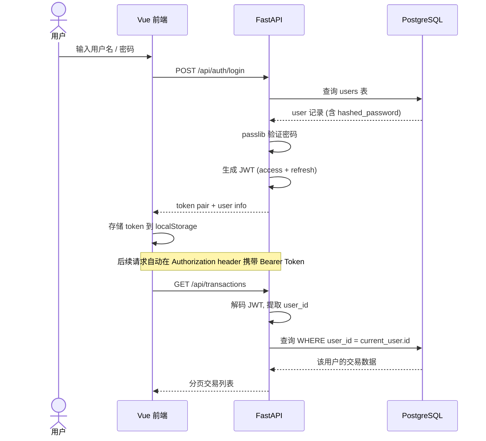
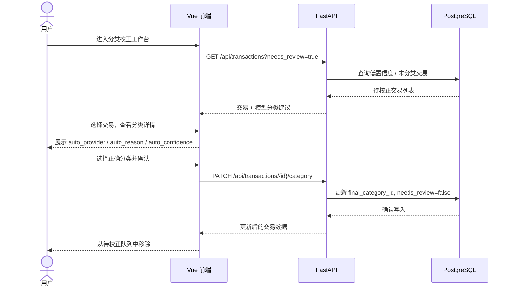

# 架构文档

## 1. 总体架构

Boring Financial 采用前后端分离 monorepo 架构。前端负责登录、账单导入、交易筛选、分类校正、统计看板和报表展示；后端负责认证、数据隔离、账单解析、分类、聚合和 PDF 生成。

低配服务器部署时推荐：

- 前端构建为静态文件，由 Nginx 提供。
- 后端监听 `127.0.0.1:8000`，由 Nginx 反向代理 `/api`。
- `TASK_ALWAYS_EAGER=true` 可减少 Celery/Redis 运行成本。
- 不在前端高频触发模型调用，重分类只在校正工作台中显式执行。

## 2. 前端模块

前端入口位于 `frontend/src`。

- `layouts/AppLayout.vue`: 深色侧边栏、顶部栏、用户区和主工作台布局。
- `pages/LoginPage.vue`: 登录/注册，深色品牌区 + 白色卡片布局。
- `pages/DashboardPage.vue`: 财务驾驶舱，复用 `/dashboard/summary`。
- `pages/ImportsPage.vue`: 账单上传、导入记录、批次进度和批次删除。
- `pages/TransactionsPage.vue`: 交易筛选、分页表格和详情抽屉。
- `pages/ReviewPage.vue`: 分类校正工作台。
- `pages/CategoriesPage.vue`: 系统分类和用户自定义分类。
- `pages/ReportsPage.vue`: 报表条件、摘要预览、PDF 生成和下载。
- `pages/SettingsPage.vue`: provider、阈值和模型配置展示。
- `pages/PersonalityPage.vue`: 消费人格测评、16 型人格画像、财务健康评分和自评偏差分析。
- `api/client.ts`: Axios 客户端，统一注入 Bearer Token。
- `stores/auth.ts`: 登录态、token、本地存储和当前用户。

前端设计系统：

- 深色导航：`#06233D` / `#041A2E`
- 主色：`#00A884`
- 页面背景：`#F5F7FA`
- 卡片背景：`#FFFFFF`
- 状态色：成功 `#22C55E`、警告 `#F59E0B`、错误 `#EF4444`、信息 `#3B82F6`

## 3. 后端模块

后端入口位于 `backend/src/backend`。

- `api/dependencies.py`: JWT 鉴权依赖注入，获取当前用户和数据库会话。
- `api/routes_auth.py`: 注册、登录、登出、当前用户。
- `api/routes_categories.py`: 分类查询、新增、更新。
- `api/routes_imports.py`: 上传文件、导入批次、上传文件列表、批次删除。
- `api/routes_transactions.py`: 交易分页查询和人工分类修正。
- `api/routes_classification.py`: 对指定交易重分类。
- `api/routes_dashboard.py`: Dashboard 聚合数据。
- `api/routes_reports.py`: PDF 报表生成和下载。
- `services/imports.py`: 导入批次创建、文件保存、解析和交易落库。
- `services/classifiers.py`: 规则、缓存、外部模型、本地模型与混合分类链路。
- `services/analytics.py`: Dashboard 聚合。
- `services/reports.py`: PDF 报表构建，含 Unicode 字体自动检测。
- `api/routes_personality.py`: 消费人格画像、心理测验题目和自评对比。
- `services/personality.py`: 四维人格计算（现时偏好/心理账户/炫耀性消费/开放性）、16 型人格分类、财务健康评分（储蓄率/收入稳定性/消费多样性/支出波动/应急能力）和测验评分与偏差分析。
- `services/bootstrap.py`: 启动时初始化默认分类和 `category_map.csv` 规则种子。

## 4. 核心数据流

1. 用户登录后上传微信或支付宝账单文件。
2. 后端创建 `import_batches` 和 `uploaded_files`，保存原始文件。
3. Parser 将不同平台账单转换为统一交易结构。
4. Normalizer 生成规范化字段和 `dedupe_hash`，避免重复导入。
5. Classifier 按规则、缓存、模型 provider 的顺序给出分类建议。
6. 分类结果写入 `transactions` 和 `classification_results`。
7. 低置信度或未命中分类的交易进入校正工作台。
8. Dashboard 和 PDF 报表基于交易表聚合生成。

## 5. 数据模型边界

主要表：

- `users`: 用户账号。
- `categories`: 系统分类和用户分类。
- `category_rules`: 分类规则预留表。
- `import_batches`: 导入批次。
- `uploaded_files`: 上传文件。
- `transactions`: 交易主表。
- `classification_results`: 分类历史结果。
- `classification_caches`: 分类缓存。
- `report_jobs` / `generated_reports`: 报表任务和生成结果。

多用户隔离策略：

- 所有用户私有资源通过 `user_id` 归属。
- 接口通过 Bearer Token 获取当前用户。
- 查询、更新、下载前验证资源归属。
- 系统分类使用 `user_id = null`，用户分类使用当前用户 ID。

### 5.1 数据库 ER 图

## 6. 核心流程时序图

### 6.1 账单导入与分类

### 6.2 用户认证

### 6.3 人工校正工作流

## 7. 分类器抽象

分类器统一输出：

- `category_id`
- `subcategory_name`
- `confidence`
- `reason`
- `provider`
- `raw_response`

当前 provider：

- `rule`: 规则分类。
- `openai_compatible_api`: 外部 OpenAI-compatible API。
- `local_model`: 本地 OpenAI-compatible 模型服务。
- `composite`: 规则优先 + 缓存 + 模型 API。
- `retry_queue`: 外部模型请求已进入统一重试池，等待后台串行处理。
- `retry_failed`: 外部模型超时重试耗尽，等待管理员重新入池。

外部模型重试池：

- 用户导入和重分类请求不会直接并发访问外部模型；交易先标记为 `auto_provider = retry_queue` 并记录 `api_retry_provider`。
- FastAPI lifespan 启动一个后台 retry queue worker，按 `updated_at` 顺序从所有用户的池子中取一笔交易，串行调用 OpenAI-compatible provider。
- 超时类错误会继续保留在 `retry_queue` 并递增 `api_retry_count`；达到上限后标记为 `retry_failed`，不进入人工校正列表。
- 管理员可通过系统设置页或 `POST /api/classification/retry-all` 把历史超时、等待重试和重试失败交易重新放入池子。
- 管理员可通过 `GET /api/classification/retry-status` 查看重试池聚合状态；该接口只返回数量、provider 分布和重试次数分布，不返回交易文本或原始错误。

## 8. 异步任务设计

Celery 任务入口：

- `import.process_batch`
- `classification.reclassify`
- `reports.build`

开发和低配服务器可使用 `TASK_ALWAYS_EAGER=true` 同步执行，减少运行组件；生产环境可改为 Redis + Celery worker 异步消费。

外部模型重试池已在后端 lifespan 中以后台线程形式运行（`retry_queue.py`），对 `auto_provider = "retry_queue"` 的交易串行重试，与 Celery 异步任务互为补充。

## 9. 可扩展方向

- 增加 `GET /api/reports` 报表历史列表。
- 将 `CategoryRule` 暴露为规则管理功能。
- 为导入、分类和报表补充 API 测试。
- 为前端增加端到端测试，覆盖课堂 demo 主流程。
- 对 Dashboard 聚合增加缓存或物化统计，支持更大数据量。
