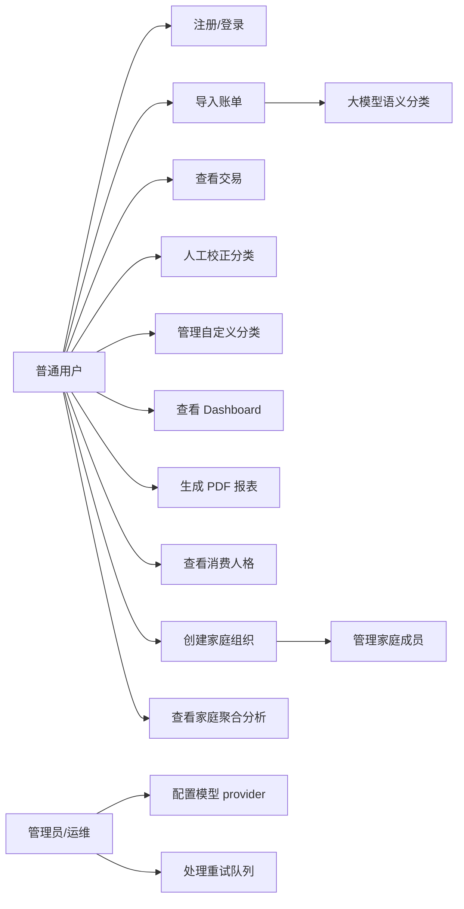
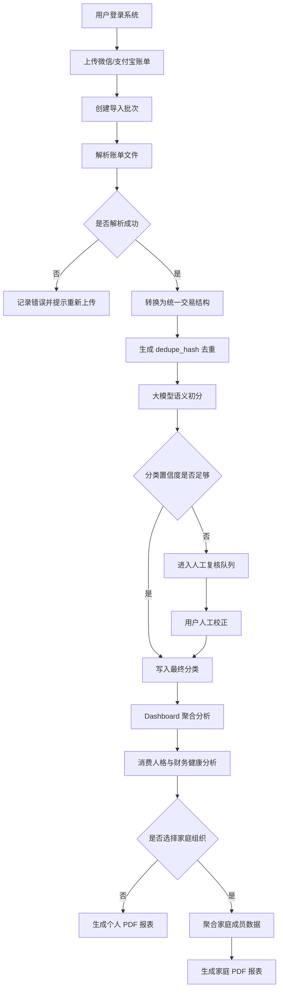

# Boring Financial 需求规格资料

## 1. 对应课程要求

本资料对应期末报告与第一次验收中的需求分析、场景和需求建模部分：

| 来源 | 覆盖内容 |
|---|---|
| lecture 3 | 列出所有需求，包括功能需求和非功能需求，并说明如何确定需求 |
| lecture 4 | 展示场景、用例图和需求建模图 |
| 验收 1 Q7 | 项目的需求是什么，如何识别这些需求 |
| 验收 1 Q8 | 需求来自哪些利益相关者 |
| 验收 1 Q9 | 是否为每种类型的利益相关者绘制场景和用例图 |
| 验收 1 Q10 | 项目中是否使用需求建模图 |

## 2. 需求获取方法

需求从客户和用户角度描述系统功能、约束和目标。本项目通过以下方式识别需求：

| 方法 | 说明 | 产出 |
|---|---|---|
| 真实账单处理流程分析 | 分析用户从下载账单到整理报表的实际步骤 | 核心业务流程和功能需求 |
| 小组讨论 | 根据课程周期、技术能力和可交付范围确定 MVP | 范围边界和优先级 |
| 误分类案例分析 | 分析“东南大学饭卡充值被归为学习”等语义误判场景 | 大模型初分、分类理由、人工校正需求 |
| 原型和联调反馈 | 根据前端页面和后端接口联调持续修正需求 | 交互需求和异常处理需求 |
| 工程质量对照 | 对照安全、性能、部署、测试等质量要求补齐非功能需求 | 可维护、可部署、可测试的工程资料 |

## 3. 利益相关者

| 利益相关者 | 关注点 | 需求来源 |
|---|---|---|
| 普通用户 | 上传账单、查看模型分类结果、修正语义误判、查看消费人格画像、生成报表 | 真实个人记账场景 |
| 家庭组织管理员 | 创建家庭组织、添加成员、调整成员角色、查看家庭聚合分析 | 家庭账本协作场景 |
| 管理员/运维 | 配置模型 provider、处理重试队列、部署和维护系统 | 部署和运行维护需求 |
| 开发与维护人员 | 实现系统、控制范围、维护代码、准备后续扩展 | 工程开发与维护过程 |

## 4. 需求优先级规则

| 优先级 | 含义 | 处理策略 |
|---|---|---|
| P0 | MVP 闭环必须具备 | 优先实现并在报告中重点说明 |
| P1 | 对完整性和体验重要 | 在时间允许时实现或作为已规划能力说明 |
| P2 | 增强功能 | 可作为未来改进，不影响核心交付 |

## 5. 功能需求

| ID | 功能需求 | 优先级 | 当前实现/资料依据 |
|---|---|---:|---|
| FR-01 | 用户可以注册、登录，并通过 token 访问系统 | P0 | README、`routes_auth.py`、前端登录页 |
| FR-02 | 系统应保证不同用户的账单、交易和报表相互隔离 | P0 | README、架构文档、多用户隔离策略 |
| FR-03 | 用户可以导入微信或支付宝账单文件 | P0 | README、导入页面、`routes_imports.py` |
| FR-04 | 系统可以将不同平台账单解析为统一交易结构 | P0 | README、`services/parsers.py` |
| FR-05 | 系统可以使用大模型对交易进行语义分类，并记录分类来源、置信度和理由 | P0 | README、`services/classifiers.py` |
| FR-06 | 用户可以查看交易列表，并按平台、日期、分类、导入文件和关键词筛选 | P0 | README、交易列表页面 |
| FR-07 | 用户可以人工校正低置信度或语义误判的交易 | P0 | README、分类校正工作台 |
| FR-08 | 用户可以维护自定义分类，并与系统分类共存 | P1 | README、分类管理页面 |
| FR-09 | 用户可以在 Dashboard 查看收入、支出、结余、储蓄率、Top 商户和分类占比 | P0 | README、Dashboard 页面 |
| FR-10 | 用户可以查看消费人格画像、财务健康评分，并通过问卷自评对比主观认知和交易数据画像 | P1 | `routes_personality.py`、`services/personality.py`、前端消费人格页面 |
| FR-11 | 用户可以创建家庭组织，并通过 owner/admin/member 角色管理家庭成员 | P1 | `routes_organizations.py`、`services/organizations.py`、前端家庭组织页 |
| FR-12 | 家庭组织成员可以在权限允许时查看家庭 Dashboard、家庭消费人格和家庭报表聚合结果 | P1 | `organization_id` 查询参数、Organization Page |
| FR-13 | 用户可以按日期和导入文件生成 PDF 报表并下载；传入组织参数时可生成家庭聚合报表 | P0 | README、报表中心、`routes_reports.py` |
| FR-14 | 系统可以在规则、外部 API 和本地模型 provider 之间切换 | P1 | README、架构文档 |
| FR-15 | 外部模型请求失败时可以进入重试队列，避免大量失败交易直接进入人工校正；组织管理员可触发家庭范围重试 | P1 | README、架构文档、`routes_classification.py` |

## 6. 非功能需求

| ID | 非功能需求 | 优先级 | 说明 |
|---|---|---:|---|
| NFR-01 | 安全性 | P0 | 密码不保存明文，业务接口需要 JWT 鉴权，用户资源需要归属校验 |
| NFR-02 | 隐私保护 | P0 | 账单、交易、分类结果和 PDF 报表属于敏感个人财务数据 |
| NFR-03 | 可用性 | P0 | 用户应能按“导入 -> 大模型初分 -> 人工校正 -> 分析 -> 报表”完成主要任务，家庭组织功能不应破坏个人默认流程 |
| NFR-04 | 性能 | P1 | 小规模试运行场景下页面和接口应保持可交互，大文件和模型调用需要控制风险 |
| NFR-05 | 可部署性 | P0 | 支持本地开发、Docker Compose 和裸机部署说明 |
| NFR-06 | 可维护性 | P0 | 前后端分离，后端按 routes、services、models、schemas 分层 |
| NFR-07 | 可测试性 | P0 | 后端具备 pytest 测试，前端可通过构建和手工验收验证 |
| NFR-08 | 可扩展性 | P1 | 分类 provider、报表生成、异步任务和部署组件应具备后续扩展空间 |

## 7. 核心用户场景

### 7.1 普通用户场景

1. 用户注册账号并登录系统。
2. 用户进入账单导入页面，上传微信或支付宝账单。
3. 系统创建导入批次，解析账单并生成统一交易记录。
4. 系统使用大模型对交易进行语义初分，并记录分类来源、置信度和简短理由。
5. 用户在交易列表中查看筛选结果，在分类校正页面修正低置信度或语义误判的分类。
6. 用户进入 Dashboard 查看支出结构、Top 商户和分类占比。
7. 用户进入消费人格页面，查看基于交易数据生成的消费人格、财务健康评分和问卷自评差异。
8. 用户进入报表中心，选择日期范围和导入文件，生成并下载 PDF 报表。

### 7.2 家庭组织场景

1. 用户创建家庭组织，系统自动将创建者设为 owner。
2. owner 或 admin 通过用户名添加成员，并可将普通成员提升为 admin。
3. 家庭成员进入家庭组织页面，查看家庭合计收入、支出、交易数、家庭消费人格雷达图和成员列表。
4. owner/admin 可以触发家庭范围内的重试或重分类操作；普通 member 只能查看聚合结果。
5. 不传入 `organization_id` 时，Dashboard、Personality 和 Reports 仍按个人账本工作。

### 7.3 管理员/运维场景

1. 管理员配置后端运行环境，包括数据库、Redis、模型 provider 和密钥。
2. 管理员部署前端、后端、数据库、Redis、模型服务和 Nginx。
3. 当模型请求超时或失败时，管理员查看 retry queue 状态。
4. 管理员在需要时将历史超时或失败交易重新放入重试队列。

## 8. 异常场景

| 场景 | 系统预期行为 |
|---|---|
| 用户未登录访问业务接口 | 返回未授权，前端跳转登录或提示登录失效 |
| 用户上传格式不支持的账单 | 导入失败并记录错误信息，用户可重新上传 |
| 重复导入同一笔交易 | 通过 `dedupe_hash` 去重，避免重复入库 |
| 模型 provider 不可用 | 使用 retry queue、规则兜底或人工校正降低影响 |
| 用户尝试访问他人报表或交易 | 后端按 `current_user.id` 校验资源归属 |
| 报表生成失败 | 记录任务状态和错误信息，用户可调整条件后重试 |

## 9. 用例图

## 10. 核心业务活动图

## 11. 需求追踪摘要

| 需求 | 对应用例 | 对应模块 | 验证方式 |
|---|---|---|---|
| 用户登录与数据隔离 | 注册/登录 | Auth API、Auth Store、JWT 依赖 | 认证测试、资源隔离测试 |
| 账单导入和解析 | 导入账单 | Imports API、ParserRegistry | 导入服务测试、手工上传验收 |
| 大模型分类和人工校正 | 大模型语义分类、人工校正分类 | Classifier、Review Page | 分类器测试、交易更新测试 |
| 统计看板 | 查看 Dashboard | Dashboard API、ECharts 页面 | 聚合测试、手工页面验收 |
| 消费人格分析 | 查看消费人格 | Personality API、Personality Page | 人格服务测试、手工页面验收 |
| 家庭组织聚合 | 创建家庭组织、管理成员、查看家庭分析 | Organizations API、Organization Page、`organization_id` 参数 | 组织权限测试、家庭聚合测试、手工页面验收 |
| PDF 报表 | 生成 PDF 报表 | Reports API、ReportBuilder | 报表测试、下载验收 |
| provider 切换和重试 | 配置模型 provider、处理重试队列 | CompositeClassifier、Retry Queue | 分类器测试、重试队列测试 |
