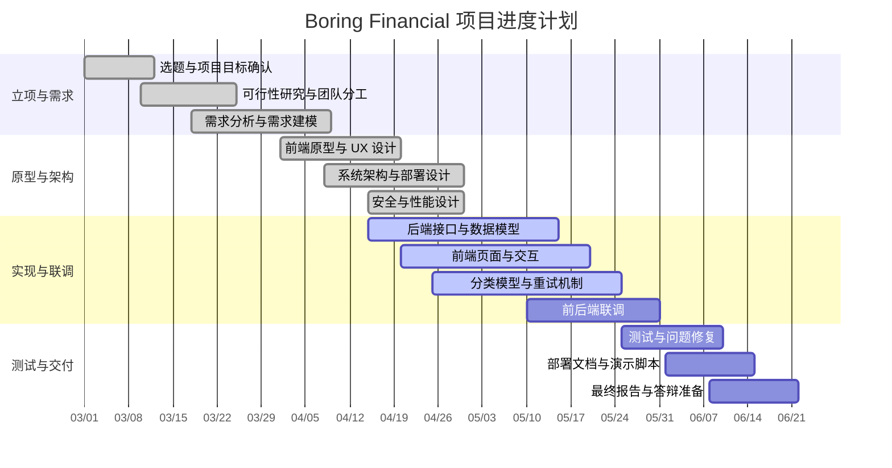

# Boring Financial 开发流程与项目计划资料

## 1. 对应课程要求

本资料对应期末报告与第一次验收中的开发过程和项目计划部分：

| 来源 | 覆盖内容 |
|---|---|
| lecture 2 | 描述项目所用流程并说明原因，在期末报告中描述项目计划/进度 |
| 验收 1 Q1 | 团队是否具备管理/技术专长，如何处理人员变动 |
| 验收 1 Q6 | 项目时间表是什么，每个任务预计完成时间，最终交付日期 |
| lecture 3-4 | 需求获取、建模、定义与后续迭代修正 |

## 2. 开发流程选择

本项目采用轻量级迭代开发流程，而不是严格瀑布模型。

选择原因：

| 原因 | 说明 |
|---|---|
| 课程周期有限 | 项目从 3 月到 6 月，需要快速形成可演示系统 |
| 需求会随原型和联调变化 | 账单格式、分类效果和页面交互需要在实现中不断修正 |
| 团队可以并行开发 | 前端、后端、模型、测试和文档可以按模块并行推进 |
| MVP 优先 | 先保证“导入 -> 大模型初分 -> 人工校正 -> 分析 -> 报表”闭环，再补增强功能 |
| 文档服务于最终交付 | 过程文档持续积累，最终统一整理成期末报告 |

开发流程图：

其中，`E -> B` 表示联调和测试过程中发现的问题会反向修正需求；`D -> C` 表示实现中发现的技术约束会反向修正架构和模块设计。

## 3. 阶段划分

| 阶段 | 时间 | 目标 | 主要产出 |
|---|---|---|---|
| 阶段 1：选题与需求 | 3 月 | 明确项目目标、团队分工、可行性和需求范围 | 项目目标、可行性说明、需求列表、第一次汇报 |
| 阶段 2：原型与架构 | 4 月 | 完成前端原型、系统架构、安全和性能初步设计 | 页面原型、组件图、部署图、安全/性能设计思路 |
| 阶段 3：功能实现与联调 | 5 月 | 完成核心功能闭环并进行前后端联调 | 登录、导入、分类、校正、Dashboard、消费人格、家庭组织、报表 |
| 阶段 4：测试、部署与报告 | 6 月 | 完成测试、部署文档、最终报告和答辩准备 | 测试结果、部署说明、最终报告、演示脚本 |

## 4. WBS 任务分解

| 编号 | 任务 | 负责人 | 依赖 | 交付物 |
|---|---|---|---|---|
| WBS-01 | 项目目标与范围确认 | 郑博文 | 无 | 项目立项与可行性资料 |
| WBS-02 | 需求分析与规格说明 | 郑博文、全体 | WBS-01 | 需求规格资料 |
| WBS-03 | 后端数据模型和接口设计 | 林子尧 | WBS-02 | ORM 模型、API 路由、接口文档 |
| WBS-04 | 账单解析和分类服务 | 林子尧、沈柔希 | WBS-03 | Parser、Classifier、分类缓存 |
| WBS-05 | 前端页面与交互实现 | 单彬 | WBS-02、WBS-03 | 登录、导入、交易、复核、Dashboard、消费人格、家庭组织、报表页面 |
| WBS-05A | 家庭组织协作能力 | 林子尧、单彬 | WBS-03、WBS-05 | Organization API、成员角色管理、家庭聚合页面 |
| WBS-06 | 模型 provider 与重试机制 | 沈柔希 | WBS-04 | provider 配置、retry queue |
| WBS-07 | 前后端联调 | 全体 | WBS-03、WBS-05 | 可运行 demo |
| WBS-08 | 测试与质量保证 | 沈柔希、全体 | WBS-07 | pytest 结果、构建结果、手工验收记录 |
| WBS-09 | 部署与运行文档 | 沈柔希、林子尧 | WBS-07 | Docker/裸机部署说明 |
| WBS-10 | 课程报告与答辩材料 | 郑博文、全体 | WBS-01 到 WBS-09 | 最终报告、演示脚本、答辩 PPT |

## 5. 里程碑表

| 里程碑 | 预计时间 | 成功标准 |
|---|---|---|
| M1：第一次验收材料完成 | 4 月上旬 | 项目名称、团队、可行性、进度、需求和需求建模可展示 |
| M2：第二次验收材料完成 | 4 月下旬 | 用户体验、系统架构、安全和性能设计可展示 |
| M3：第三次验收材料完成 | 5 月中旬 | IDE、组件复用、类图、对象图、顺序图、设计模式和扩展性可说明 |
| M4：第四次验收材料完成 | 5 月下旬 | 测试覆盖率、单元/集成/验收测试、可靠性和容错设计可说明 |
| M5：最终交付完成 | 6 月 | 系统 demo、测试结果、部署资料、最终报告和答辩材料完整 |

## 6. 简化甘特图

## 7. 成员任务分配

| 成员 | 主要任务 | 协作对象 | 交付检查点 |
|---|---|---|---|
| 郑博文 | 项目管理、需求统筹、报告结构、答辩材料 | 全体 | 需求和报告是否覆盖课程要求 |
| 林子尧 | 后端接口、数据库、导入解析、业务服务 | 单彬、沈柔希 | API 是否稳定，测试是否通过 |
| 单彬 | 前端页面、交互流程、图表展示 | 林子尧 | 页面是否能完成核心用户任务 |
| 沈柔希 | 分类模型、测试、部署、联调 | 林子尧、单彬 | 分类链路、测试结果和部署资料是否完整 |

## 8. 变更管理

| 变更类型 | 处理方式 |
|---|---|
| 新增功能需求 | 先判断是否影响 MVP；若不影响核心闭环，放入后续增强 |
| 接口字段变化 | 后端更新接口文档，前端同步修改 API client 和类型 |
| 家庭组织权限变化 | 先保证个人账本默认行为不变，再扩展 `organization_id` 聚合查询 |
| 分类策略变化 | 保留规则兜底，记录 provider、置信度和分类理由 |
| 页面交互变化 | 优先不破坏核心流程，避免答辩前大幅改版 |
| 部署环境变化 | 以轻量本地启动和 Docker Compose 两套方案保障可演示性 |

## 9. 人员变动预案

| 情况 | 预案 |
|---|---|
| 后端负责人暂时缺席 | 其他成员根据接口文档、测试和分层结构接手小范围修复 |
| 前端负责人暂时缺席 | 使用现有页面和 Element Plus 组件完成最低可演示版本 |
| 模型或部署负责人暂时缺席 | 切换到规则分类或本地 mock，保证 demo 不依赖外部模型 |
| 报告负责人暂时缺席 | 由现有 docs、README、PPT 和课程要求表继续整理 |

## 10. 交付标准

| 交付项 | 标准 |
|---|---|
| 系统 demo | 可以完成“导入 -> 大模型初分 -> 人工校正 -> 分析 -> 报表”个人主流程，并展示家庭组织聚合能力 |
| 需求资料 | 功能需求、非功能需求、利益相关者、用例图和活动图完整 |
| 设计资料 | 架构、组件、部署、类图、对象图和顺序图可解释 |
| 测试资料 | 后端测试、前端构建、手工验收和测试覆盖率有记录 |
| 部署资料 | 本地开发、Docker Compose 和裸机部署说明清晰 |
| 最终报告 | 按真实开发流程组织，同时覆盖课程明确要求和验收问题 |
