# Boring Financial 期末报告绘图新版

本文档集中维护期末报告中的“图”。除页面截图组外，所有可绘制图均使用 PlantUML 支持的格式，便于统一渲染为 PNG/SVG 后放入 LaTeX。表格类图表（需求表、风险矩阵、测试用例表等）仍放在正文对应章节中，不在这里重复绘制。

排版原则：

- 大图按层、按职责分组，避免“所有节点一锅炖”。
- ER 图和类图拆成子图，报告中可作为同一图号下的 (a)(b) 子图。
- 用例图减少直连线，利用 actor 泛化和 usecase 分组提高可读性。
- 顺序图用 `box` 分组，突出前端、后端服务、数据/外部服务边界。
- PlantUML 渲染建议使用 SVG；若放入 Word/PDF，可导出 PNG。

本版基于当前 main 代码结构：

- 前端包含 `DashboardPage`、`ImportsPage`、`TransactionsPage`、`ReviewPage`、`CategoriesPage`、`PersonalityPage`、`OrganizationPage`、`ReportsPage`、`SettingsPage`。
- 后端包含 `routes_personality.py`、`routes_organizations.py`、`services/personality.py`、`services/organizations.py`。
- Dashboard、Personality、Reports 支持可选 `organization_id`，用于家庭组织聚合。
- 个人账本默认口径不变，家庭组织通过 owner/admin/member 角色控制访问。
- 类图按设计模式拆为四张：领域实体（Data Mapper + Mixin）、分类器策略（Strategy + Chain of Responsibility + Facade）、解析器（Strategy + Adapter + Registry）、报表构建器（Builder）。

## 1. 开发流程图

用于第 2 章“开发流程选择”。用泳道表达开发阶段和反馈回路。

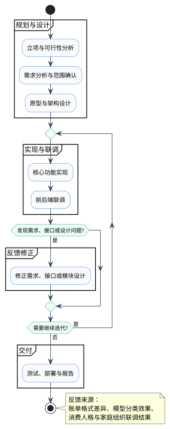

## 2. 简化甘特图

用于第 2 章“项目进度计划”。PlantUML 甘特图排版更适合横向放置。

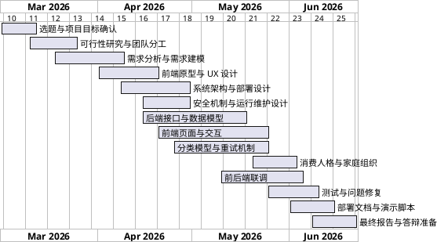

## 3. 用例图

用于第 3 章“用例建模”。用 actor 泛化减少普通用户和家庭管理员之间的重复连线。

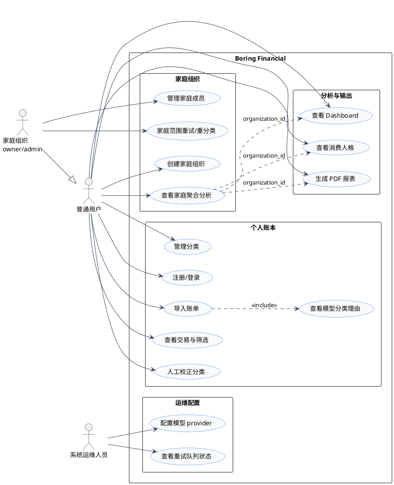

## 4. 核心业务活动图

用于第 3 章“业务流程建模”。按“导入分类”和“分析输出”分段，减少活动图过长带来的视觉拥挤。

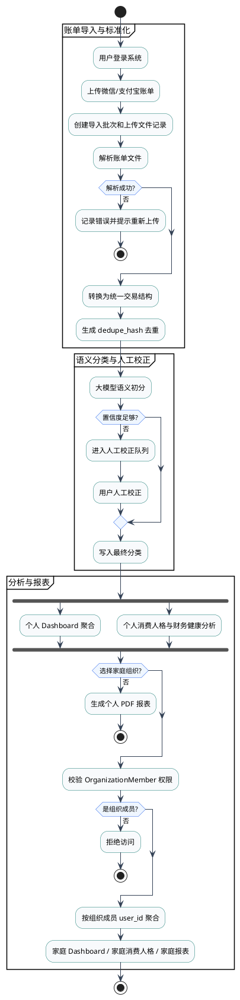

## 5. 系统总体架构图

用于第 5 章”总体架构”。自上而下分层，适合报告纵向排版。

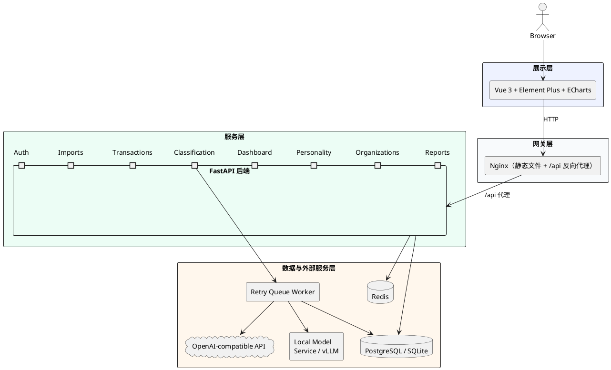

## 6. UML 组件图

用于第 5 章”组件图”。自上而下分层，减少横向宽度。

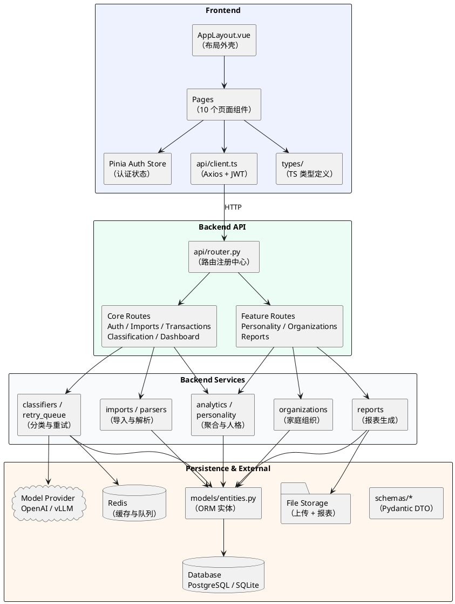

## 7. 包图

用于第 5 章“包图”。减少嵌套层级，用子包分组表达目录结构。

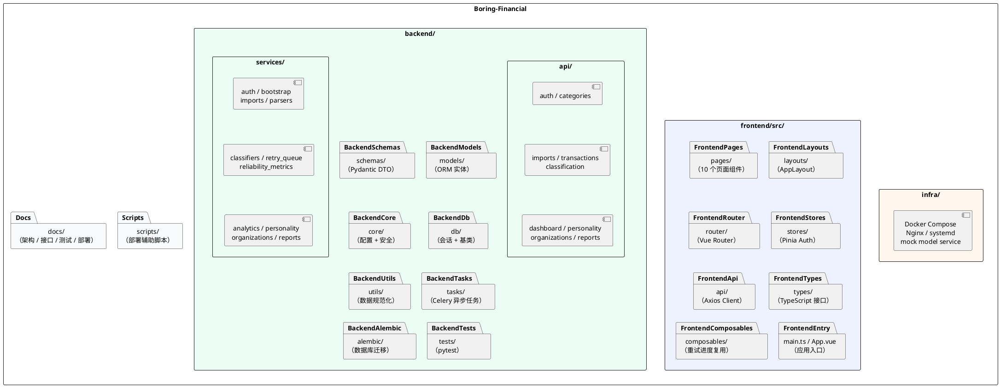

## 8. 部署图

用于第 5 章”部署图”。自上而下，服务器内部组件分组展示。

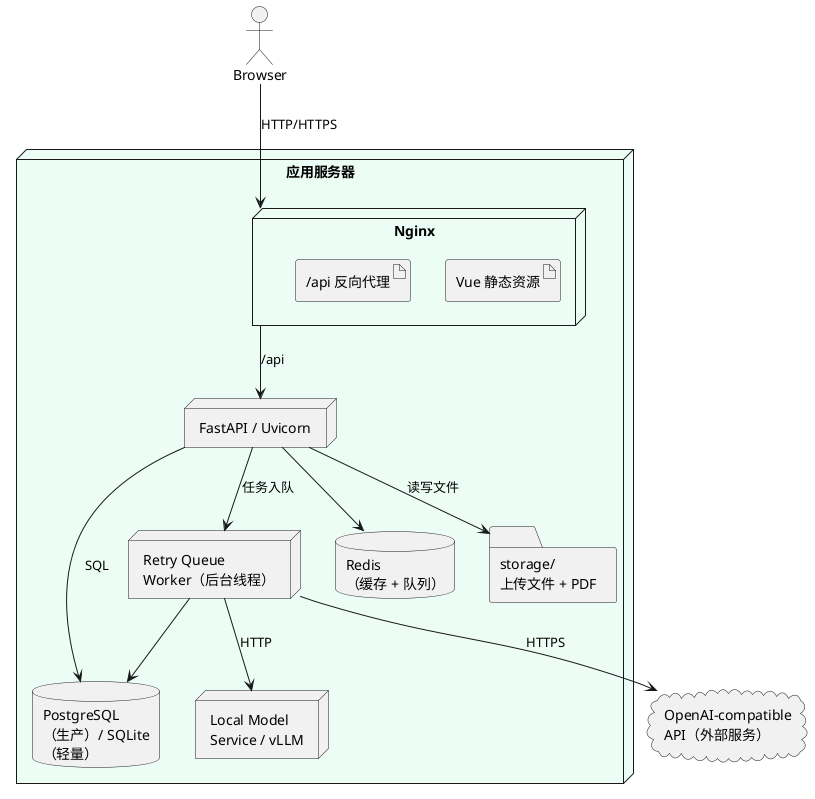

## 9. ER 图

用于第 6 章“数据库设计”。建议拆成两张子图：核心账单 ER 和家庭/报表扩展 ER。这样比一张巨型 ER 图更适合报告排版。

### 9.1 核心账单 ER 图

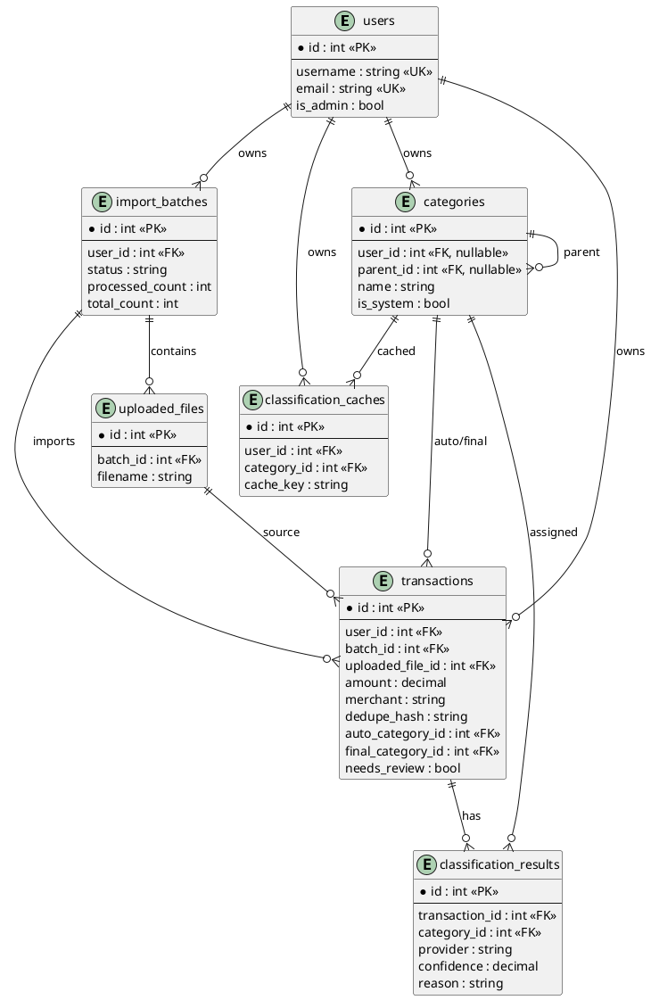

### 9.2 家庭组织与报表扩展 ER 图

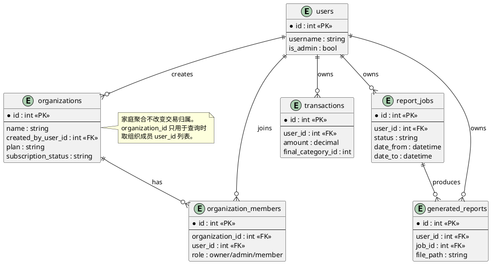

## 10. 类图

用于第 6 章”面向对象组织方式”。按设计模式拆为四张独立类图：领域实体（Data Mapper + Mixin）、分类器策略（Strategy + Chain of Responsibility + Facade）、解析器（Strategy + Adapter + Registry）、报表构建器（Builder）。

### 10.1 领域实体类图

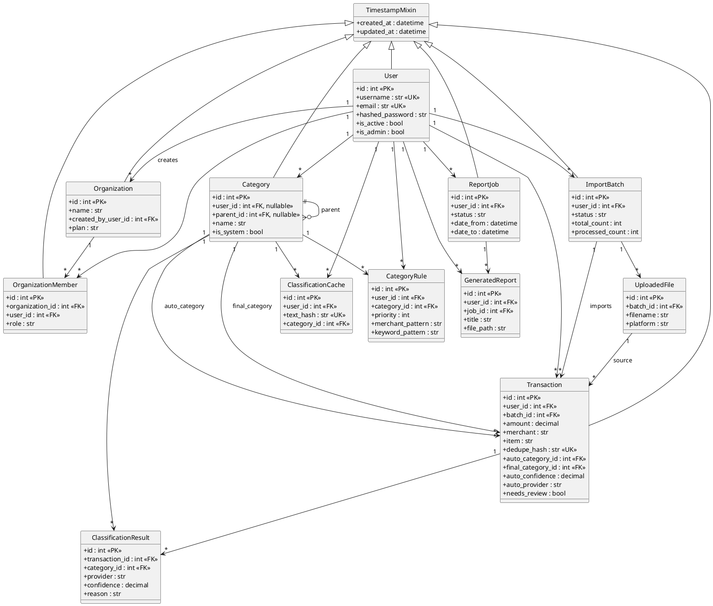

### 10.2 分类器策略类图

用于第 6 章 §6.1.2，展示 Strategy + Chain of Responsibility + Facade 模式。

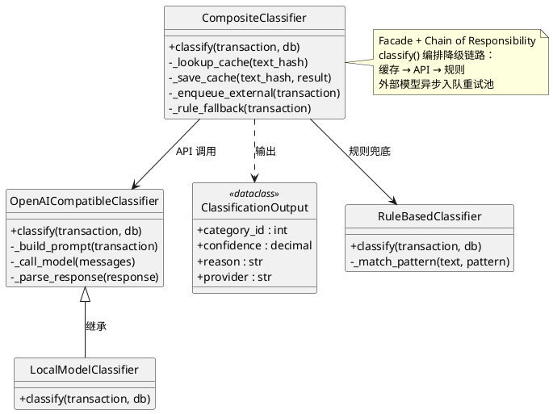

### 10.3 解析器类图

用于第 6 章 §6.1.3，展示 Strategy + Adapter + Registry 模式。

```plantuml
@startuml
skinparam backgroundColor transparent
skinparam shadowing false
skinparam classAttributeIconSize 0
hide circle

class ParsedTransaction <<dataclass>> {
  +platform : str
  +occurred_at : datetime
  +type : str
  +amount : decimal
  +merchant : str
  +item : str
}

interface StatementParser {
  +parse(df) : list[ParsedTransaction]
}

class AlipayParser {
  +parse(df)
}

class WeChatParser {
  +parse(df)
}

class StatementReader {
  +read(file_path)
  -_detect_encoding()
  -_find_header_row()
}

class ParserRegistry {
  +parse_file(path)
  -_detect_platform_hint()
  -_ordered_parsers()
}

class TransactionNormalizer {
  +normalize(tx)
  +build_dedupe_hash(tx)
}

AlipayParser ..|> StatementParser
WeChatParser ..|> StatementParser
ParserRegistry --> StatementReader
ParserRegistry --> StatementParser
ParserRegistry --> TransactionNormalizer

note right of ParserRegistry
  Registry / Factory
  检测平台 → 选择解析器
end note

note right of StatementReader
  Adapter：封装 pandas
  编码检测 + 表头定位
@end note
@enduml
```

### 10.4 报表构建器类图

用于第 6 章 §6.1.4，展示 Builder 模式。

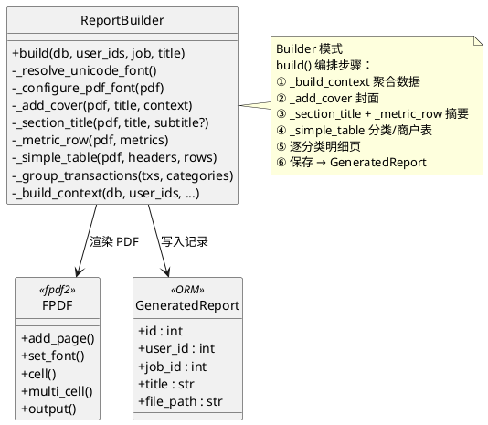

## 11. 对象图

用于第 6 章“面向对象组织方式”。对象图只展示家庭聚合场景，不把所有交易对象都摊开。

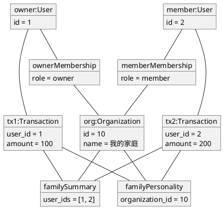

## 12. 账单导入与大模型初分顺序图

用于第 6 章“核心顺序设计”。用 `box` 分组，减少参与者横向散乱。

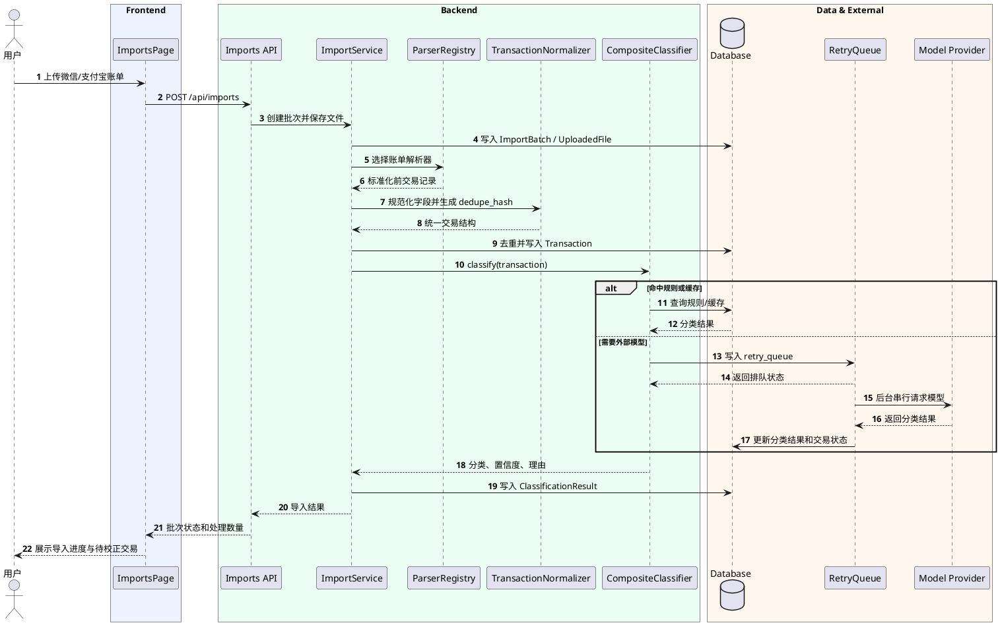

## 13. 家庭聚合查询顺序图

新增图，可用于第 6 章或作为家庭组织功能补充图。若报告篇幅紧张，可以不放，正文引用组件图和活动图即可。

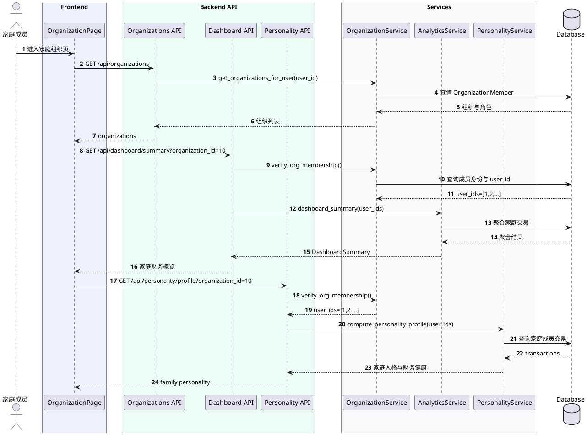

## 14. 页面截图组

用于第 4 章“主要页面原型”。这部分不建议画页面导航图，直接放截图即可。

建议截图顺序：

1. 登录/注册页
2. Dashboard 财务驾驶舱
3. 导入账单页
4. 交易列表页
5. 分类校正工作台
6. 分类管理页
7. 消费人格页
8. 家庭组织页
9. 报表中心
10. 系统设置页

截图说明重点：

- Dashboard 展示个人统计口径。
- 消费人格页展示个人消费人格、财务健康和问卷自评。
- 家庭组织页展示 owner/admin/member 角色、家庭成员列表、家庭财务概览和家庭消费人格。
- 报表中心说明个人报表和家庭聚合报表共用报表生成能力。

## 15. 不再绘制的图

以下图与新版主流程或其他图功能重合，建议继续不画：

- 页面导航图：由截图组和活动图覆盖。
- 用户旅程图：由用户场景文字和活动图覆盖。
- 登录顺序图：认证流程较常规，报告重点不在此。
- 报表顺序图：可由组件图、活动图和接口设计说明覆盖。
- 安全边界图：和总体架构图高度重合。
- 性能请求链路图：用性能瓶颈表说明即可。
